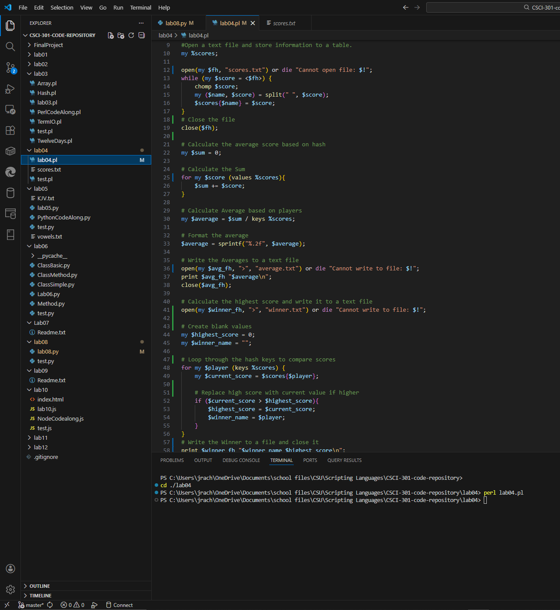

Portfolio
=========

Programming Projects
--------------------

*For access to my private project repositories, please [email me](mailto:jrachel@csuniv?subject=GitHub%20Access) with the subject line, GitHub Access.

---
### [Lab 04 | CSCI 301](project1)

---
### [Project 2 Title | CSCI 315](project1)

---

Ethics Papers
-------------

### [Human Elements of Cybersecurity](/pdf/RachelJoshua-Human-Elements-of-Cybersecurity.pdf)

-   **Class: CSCI 405-Principles of Cybersecurity**  
-   **Grade:87**

Page template forked from <a href="https://github.com/csu-cs/csci-portfolio">CSU-CS</a>

<!-- Remove above link if you don't want to attributive -->
