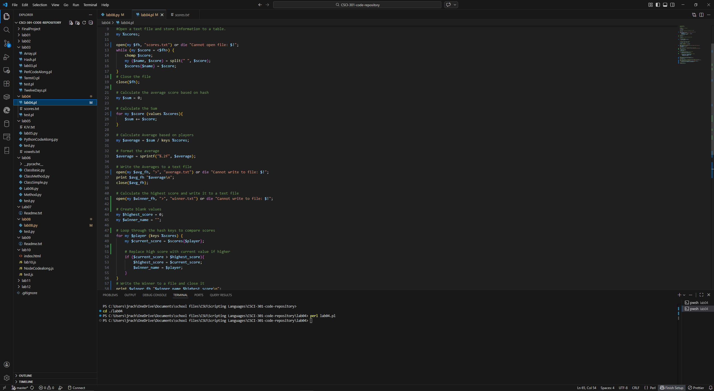
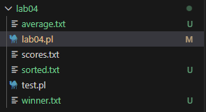
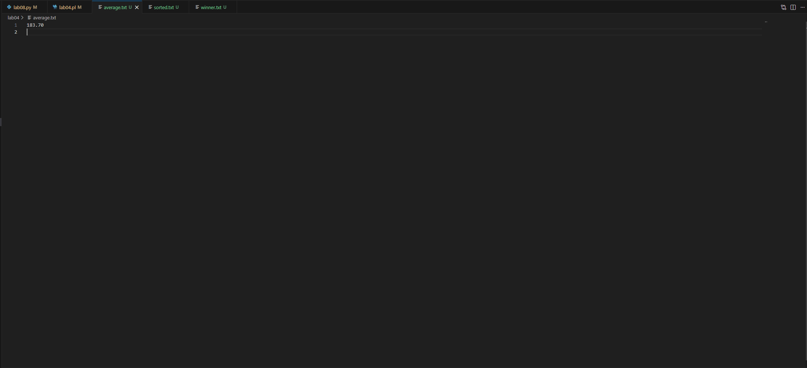
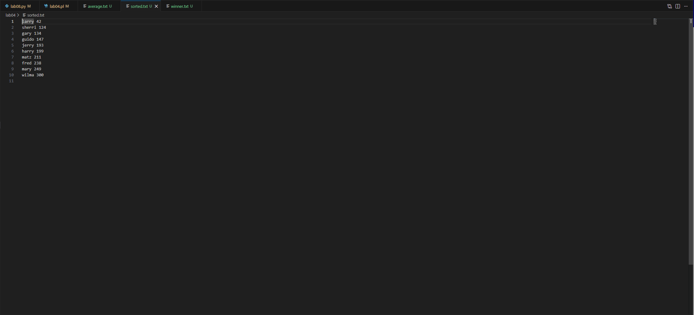
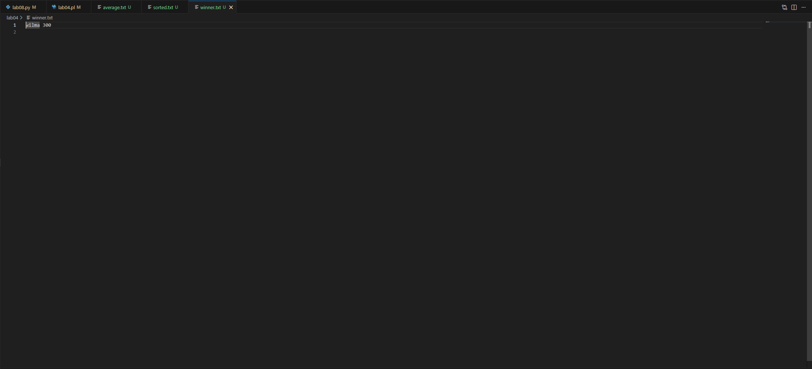
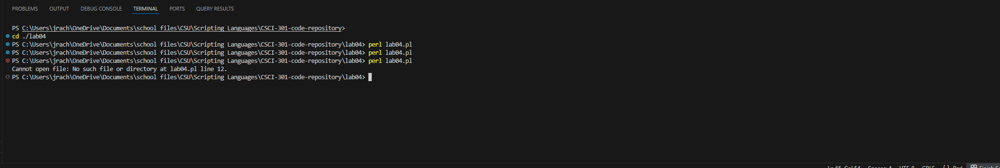
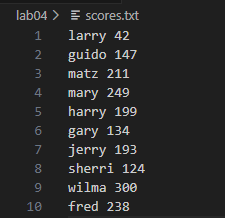

[Back to Portfolio](./)

Lab 04 - Bowling Scores
===============

-   **Class: CSCI 301** 
-   **Grade: 93** 
-   **Language(s): Perl** 
-   **Source Code Repository:** ([lab04](https://github.com/JoshuRach09/CSCI-331-Lab04-Bowling-Scores))  
    (Please [email me](mailto:jrachel@csuniv.edu?subject=GitHub%20Access) to request access.)

## Project description

This Perl script processes bowling scores from a text file named 'scores.txt', where each line contains a player's name followed by their score. It calculates the average score, identifies the player with the highest score, and sorts the players by their scores in ascending order. The results are written to three output files: 'average.txt' for the average score, 'winner.txt' for the winner's name and score, and 'sorted.txt' for the sorted list of players and scores.

## How to run the program

The perl script does not require compilation. To successfully run the program, please ensure that 'scores.txt' is present in the same directory and is formatted "name score" on each line. To proceed with executing the program, you will need to do the following.

```bash
cd ./lab04
perl lab04.pl
```

This program will generate three output files: average.txt, winner.txt, and sorted.txt

## UI Design

This is a command-line script without an interactive user interface. The user runs the script in a terminal, and it processes the input file silently, producing output files. Users can view the results by opening or using the Linux command "cat" to view the output files. The program execution starts in the terminal (see Fig 1). After running, the example output can be viewed in the generated files (see Fig 2), such as the average score (see Fig 3), sorted scores (see Fig 4), and the winner (see Fig 5). If an error occurs, such as a missing input file, Perl will display an error message in the terminal (see Fig 6).

  
Fig 1. The launch screen

  
Fig 2. The generated files.

  
Fig 3. Average Score.

  
Fig 4. Sorted Scores.

  
Fig 5. Winning Score.

  
Fig 6. Error if score file is missing.

  
Fig 7. scores.txt

## 3. Additional Considerations

Please ensure the input file 'scores.txt' is properly formatted (see Fig 7), with one player per line and numeric scores. The script uses strict and warnings for better error handling. For deployment, it can be run on any system with Perl installed. You can run the program in VS code, ensure that it can run perl.

[Back to Portfolio](./)
