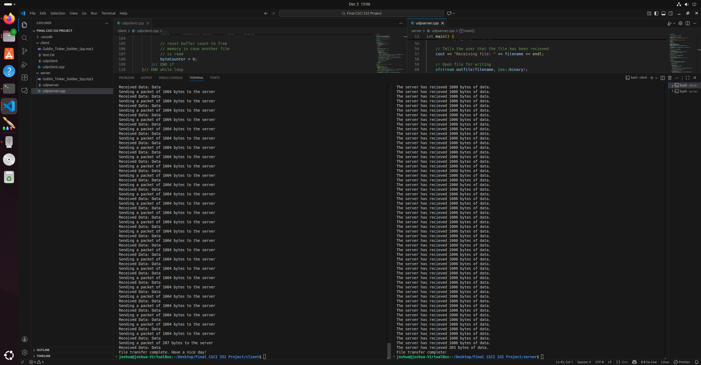
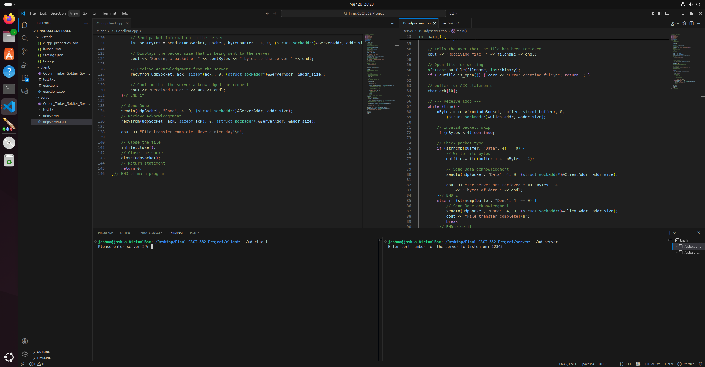
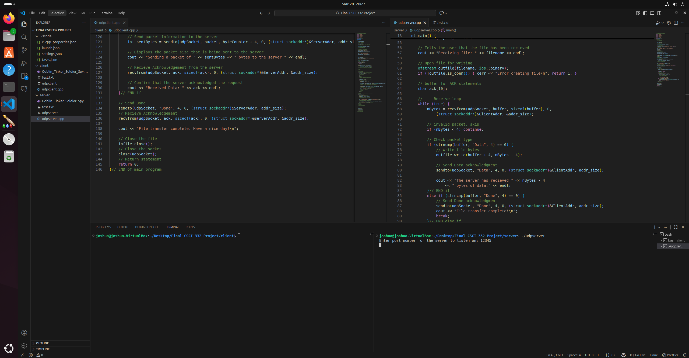
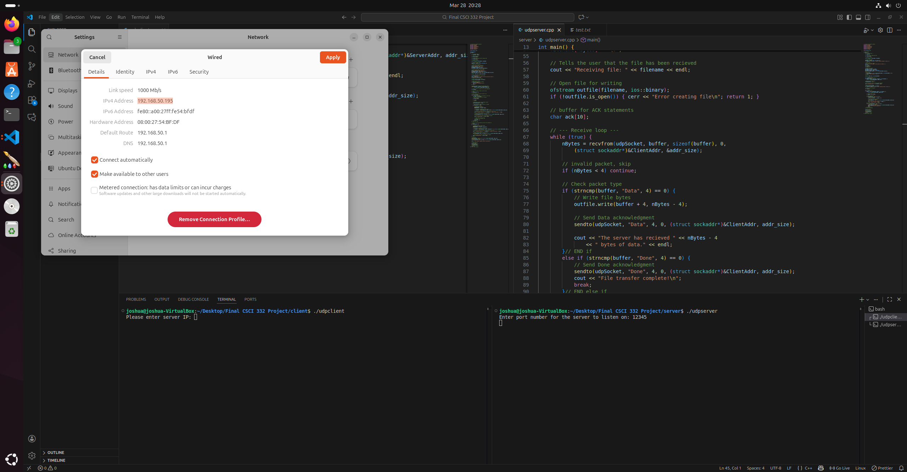
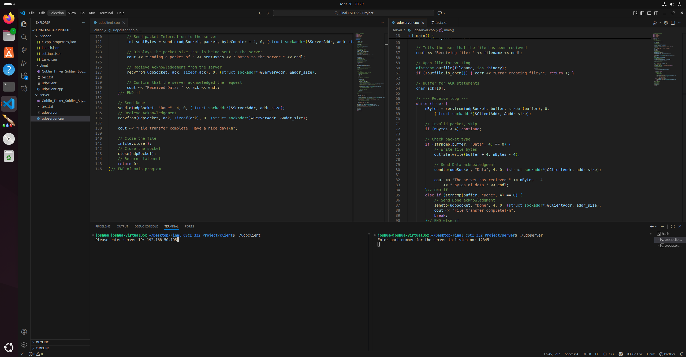
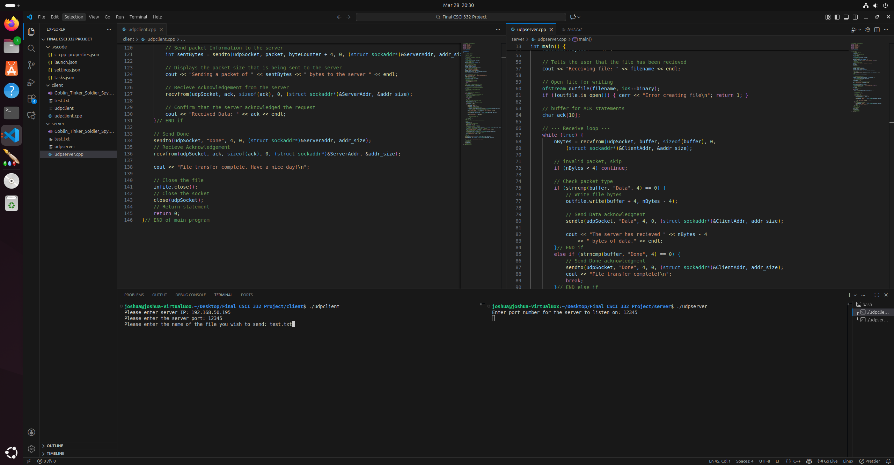
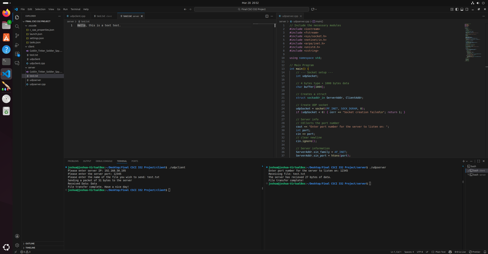

[Back to Portfolio](./)

CSCI 332 - Airdrop
===============

-   **Class: CSCI 332** 
-   **Grade: 100** 
-   **Language(s): C++, Binary** 
-   **Source Code Repository:** ([Airdrop](https://github.com/JoshuRach09/csci-332-Airdrop))  
    (Please [email me](mailto:jrachel@csuniv.edu?subject=GitHub%20Access) to request access.)

## Project description

This C++ project implements a reliable file-transfer application called “Air Drop” using UDP sockets in Ubuntu Linux. The client reads a binary file specified by the user, sends the filename first, then transmits the file in 1000-byte packets prefixed with a “Data” header. After each packet, the client waits for an acknowledgment from the server. The server receives the filename, creates a new binary output file, reconstructs the file from the incoming packets, and sends back either a "Data" or a "Done" acknowledgement. The program will send a final “Done” packet to signal the end of transfer. This creates a custom stop-and-wait protocol that guarantees reliable delivery over UDP.

## How to run the program

The programs must be compiled before use. Ensure the source files (client.cpp and server.cpp) are in the working directory. Place the file you wish to transfer into the client folder. Right-click the "udpclient" and "udpserver" cpp files and open an integrated terminal for each. Be sure to run the compilation code for both the server and the client, and then run the server starter command first, then the client.

server.cpp
```bash
g++ udpserver.cpp -o udpserver
./udpserver
```

The server will ask the user to enter the port number to use for the project. For simplicity's sake, use 12345.

client.cpp
```bash
g++ udpclient.cpp -o udpclient
./udpclient
```

The client will ask for the server's IP address, which will be the VM/Linux machine's IP(V4) address. Next, it will ask for the port number, and the user will enter the one used for the server. Finally, it will ask the user for the file name and check whether it is valid; if not, it will tell them it could not open it and prompt them again.


## UI Design

This is a command-line application consisting of two separate programs (client and server) that must run in two terminal windows. 

  
Fig 1. The final result.

  
Fig 2. The program will ask for the server IP address.

  
Fig 3. The program will ask for the port number.

  
Fig 4. This is how you find the server's IP address(your VM IP).

  
Fig 5. Enter the IP address of your VM.

  
Fig 6. Error if score file is missing.

  
Fig 7. scores.txt

## Demo Video

Below, you can find a demo video I did for the class that shows the program in action.

[Demo for Airdrop](https://youtu.be/vvuQGXbCeOc)

## 3. Additional Considerations

Please ensure the input file 'scores.txt' is properly formatted (see Fig 7), with one player per line and numeric scores. The script uses strict and warnings for better error handling. For deployment, it can be run on any system with Perl installed. You can run the program in VS code, ensure that it can run perl.

[Back to Portfolio](./)
